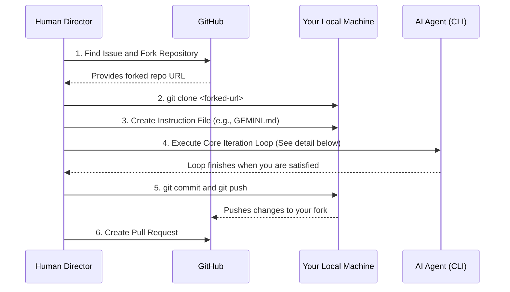
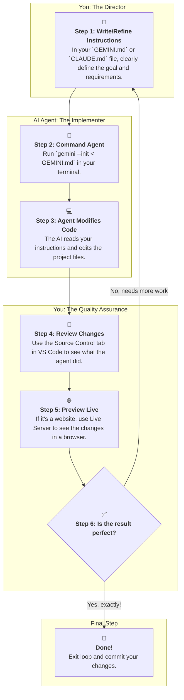

# XpressLab - Xpress Yourself with AI Agents

### XpressLab Overview

XpressLab is an innovative platform designed to empower individuals to express themselves and showcase their skills by directing AI Agents on GitHub. We believe in the power of human-AI collaboration and the exponential opportunities it brings for personal and professional growth. By following our carefully crafted instructions, you will learn to guide powerful AI agents to contribute your unique vision, ideas, and solutions to projects on GitHub. This allows you to learn and make an impact at a massive scale, focusing on strategy and creativity while your agent handles the code.

Join XpressLab today and embark on a journey of high-level contribution, skill multiplication, and financial prosperity. Together, we can shape the future of open-source development, leveraging your unique talents to make a significant impact while enjoying the financial rewards that come with your strategic direction.

---

### **Search for Open Issues**
Look through the following Organization's Issues below by hitting (Ctrl-Click) on the link, based upon your area of interest.

- [World Enterprise](https://github.com/search?l=&q=user%3Aworldenterprisegroup+label%3A"good+first+issue"&type=issues) - Graphics, Copywriting, & Website Design for Startups
- [Note Hive](https://github.com/search?l=&q=user%3ANote-Hive+label%3A"good+first+issue"&type=issues) - Documentation, Grants, Guides, Handbooks, and other Writing Projects
- [United Home](https://github.com/search?l=&q=user%3AUnited-Home+label%3A"good+first+issue"&type=issues) - Home, Lifestyle, and Architectural Projects
- [HardMagic](https://github.com/search?l=&q=user%3AHardMagic+label%3A"good+first+issue"&type=issues) - Design, Ideation, Storytelling, Branding, Visionary, Futurism, Creative Direction
- [Tao Learning Institute](https://github.com/search?l=&q=user%3ATaoLearning+label%3A"good+first+issue"&type=issues) - Non-Profit Organization focused on STEAM Literacy, Learning, & Development
- [INSTAR Lab Inc](https://github.com/search?l=&q=user%3AINSTARLab+label%3A"good+first+issue"&type=issues) - Scientific Research Institute with projects in Quantum Research, Artificial Intelligence, and the Future of Work.
- [Source Now](https://github.com/search?l=&q=user%3ASource-Now+label%3A"good+first+issue"&type=issues) - Data Science, Data Analysis, Forensics, Data Research
- [SILK Corp](https://github.com/WorldEnterpriseGroup/silkcorp/issues) - Public Benefit Corporation focused on Women Empowerment, DE&I, Homesteading, Health & Wellness Industry
- [SILK Corp Guide](https://github.com/NoteHive/Silk-Corp-Guide) - SILK Corp Franchise Model
- [Curiosity Corp](https://github.com/Curiosity-Corp) - Nonprofit organization dedicated to advancing innovative education and workforce training through dynamic, experiential learning

### **Understand Issue Types**
This chart below describes a few of our most common issue types:
- $\color{orange}{media}$ $\color{orange}{content}$ - Visual and Audio Content including Graphics, Commercials, Sound Bytes, etc
- $\color{BurntOrange}{content}$ $\color{BurntOrange}{writing}$ - Long Form Writing that engages, motivates, and potentially converts users to take action
- $\color{yellow}{copywriting}$ - Short Form Writing text for advertising and marketing
- $\color{violet}{good}$ $\color{violet}{first}$ $\color{violet}{issue}$ - Good for newcomers
- $\color{green}{help}$ $\color{green}{wanted}$ - Extra attention is needed - great for external contributors
- $\color{lightblue}{documentation}$ - Improvements or additions to documentation

---

## 🚀 The Agentic Workflow

This is where the real power lies. You will act as the director, and your AI Agent will be the one writing the code. Your role is to provide clear, high-level instructions and review the results.

### 1. **Environment Setup**

First, prepare your local machine with the necessary tools.

1.  **Install Git:** Download from [git-scm.com](https://git-scm.com/downloads).
2.  **Install NodeJS:** We recommend version 24 or later. Download from [nodejs.org](https://nodejs.org/).
3.  **Install VS Code:** Download the [Insider's Edition](https://code.visualstudio.com/insiders/) for the latest features.

### 2. **Install Your AI Code Agents**

Open your terminal or command prompt and install one or more of the following AI agents. You can install all of them and choose which one to use for any given task.

*   **Google Gemini CLI:**
    ```bash
    npm install -g @google/gemini-cli
    ```
*   **Anthropic Claude Code:**
    ```bash
    npm install -g @anthropic-ai/claude-code
    ```
*   **OpenAI Codex CLI (Legacy):**
    ```bash
    npm install -g @openai/codex@native
    ```

### 3. **Configure VS Code with Essential Extensions**

Enhance VS Code with these extensions. Open VS Code, go to the Extensions tab (Ctrl+Shift+X), and install them:

*   **Core GitHub & Workflow Tools:**
    *   [GitHub Pull Requests and Issues](https://marketplace.visualstudio.com/items?itemName=GitHub.vscode-pull-request-github): Manage PRs directly in the editor.
    *   [GitHub Repositories](https://marketplace.visualstudio.com/items?itemName=GitHub.remotehub): Browse and edit any GitHub repository without cloning.
    *   [Remote Repositories](https://marketplace.visualstudio.com/items?itemName=ms-vscode.remote-repositories): Work with source code in remote repositories.
    *   [Live Server](https://marketplace.visualstudio.com/items?itemName=ritwickdey.LiveServer): Instantly preview website changes in your browser.
    *   [Live Share Extension Pack](https://marketplace.visualstudio.com/items?itemName=MS-vsliveshare.vsliveshare): Real-time collaborative development.
    *   [Markdown Preview Enhanced](https://marketplace.visualstudio.com/items?itemName=shd101wyy.markdown-preview-enhanced): A must-have for editing documentation.
*   **In-Editor AI Assistants (Optional but Recommended):**
    *   [GitHub Copilot](https://marketplace.visualstudio.com/items?itemName=GitHub.copilot): The original AI pair programmer.
    *   [Gemini Code Assist](https://marketplace.visualstudio.com/items?itemName=GoogleCloudTools.google-cloud-code): Google's powerful AI assistant.
    *   [Claude for VS Code](https://marketplace.visualstudio.com/items?itemName=Anthropic.claude-vscode): Anthropic's context-aware AI assistant.

### 4. **The Agentic Workflow: A High-Level View**

This first diagram shows the entire process from start to finish. Think of it as your project map.



### 5. **The Core Agentic Iteration Loop (Detailed View)**

This is the most important part of the process. You will repeat this loop until the task is completed perfectly. Your job is to be the visionary; the agent's job is to handle the implementation.



### 6. **Prepare Instructions for Your Agent**

As highlighted in the diagrams, your instruction file is the key to success.

1.  After cloning a repository, create a new file named `GEMINI.md` or `CLAUDE.md`.
2.  Run the `/init` command if the agent supports it, or simply use our template below. This file is your control panel for the AI.

**Instruction File Template (`GEMINI.md`):**
```markdown
# TASK: Update the Call-to-Action button on the homepage (Resolves Issue #45)

## 1. Goal
The current button text "Submit" is not engaging. We need to update it to "Start Your Free Trial" and change its color to a vibrant blue.

## 2. Files to Modify
The agent should first locate the primary homepage file, likely named `index.html`, `main.jsx`, or `HomePage.vue`. It should also find the corresponding CSS file that styles this button.

## 3. Requirements
- **HTML/JSX Change:** Find the button with the text "Submit" and change its text to "Start Your Free Trial".
- **CSS Change:**
    - Give the button a new CSS class if it doesn't have one, e.g., `cta-button`.
    - Style `.cta-button` with `background-color: #007bff;` and `color: white;`.
    - Ensure there are no regressions or visual bugs.

## 4. Verification
After the changes, the button on the homepage should be blue and read "Start Your Free Trial".
```

### 7. **Execute, Review, and Iterate**

Now, follow the Core Agentic Iteration Loop you saw in the diagram.

1.  **Execute:**
    ```bash
    # For Gemini
    gemini --init < GEMINI.md

    # For Claude
    claude -p "Carefully read the instructions in CLAUDE.md and execute the required code changes across the necessary files."
    ```
2.  **Review:**
    *   Your agent will report the files it has changed.
    *   Open the "Source Control" tab in VS Code to see a `diff` of the changes.
    *   If you're working on a website, right-click your `index.html` file and select "Open with Live Server" to see the changes live in your browser.
3.  **Iterate:**
    *   If the agent made a mistake or you want to refine the result, **do not edit the code yourself.**
    *   **Update your instruction file.** Add more detail. For example: "The blue color is too dark. Use `#3399ff` instead."
    *   Run the agent again. Repeat this loop until the output is perfect.

### 8. **Commit and Create Your Pull Request**

Once you're satisfied and have exited the loop, it's time to submit your contribution.

1.  Ask your agent to write the commit message for you based on the changes.
    ```bash
    claude "Based on the staged changes, write a conventional commit message that references issue #45."
    ```
2.  Copy the message and commit your changes through the VS Code UI.
3.  Push your branch and create a Pull Request on GitHub. Your PR description should link to the issue and can include a summary of the changes, which you can also ask your agent to write.

---
## Contributing & Earning Money
> We welcome Pull Requests from everyone. By leveraging AI agents, you can make substantial contributions with impressive speed.
>
> :money_mouth_face: $\color{green}{Want}$ $\color{green}{to}$ $\color{green}{Make}$ $\color{green}{Money!?}$- We provide compensation for significant contributions to our projects. To be eligible, add a USDT (TRC-20) wallet address to your GitHub profile bio.
> - [Where to find my USDT Wallet Address?](https://www.followchain.org/binance-wallet-address)
> - [Sample GitHub Profile with USDT Wallet](https://github.com/yennefer-m)
